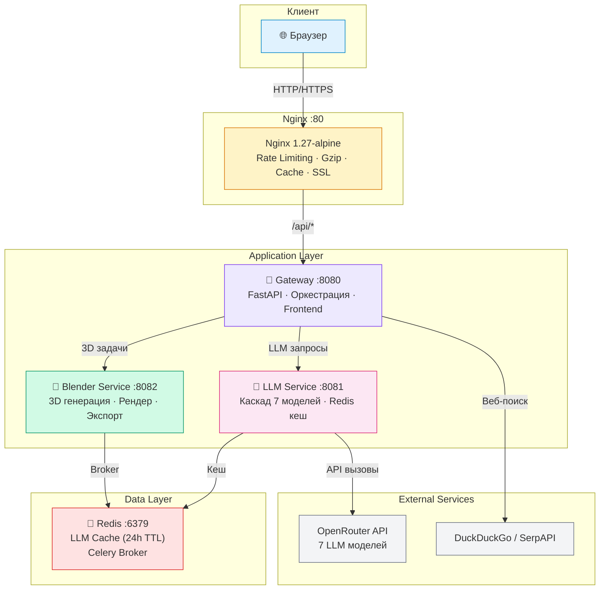
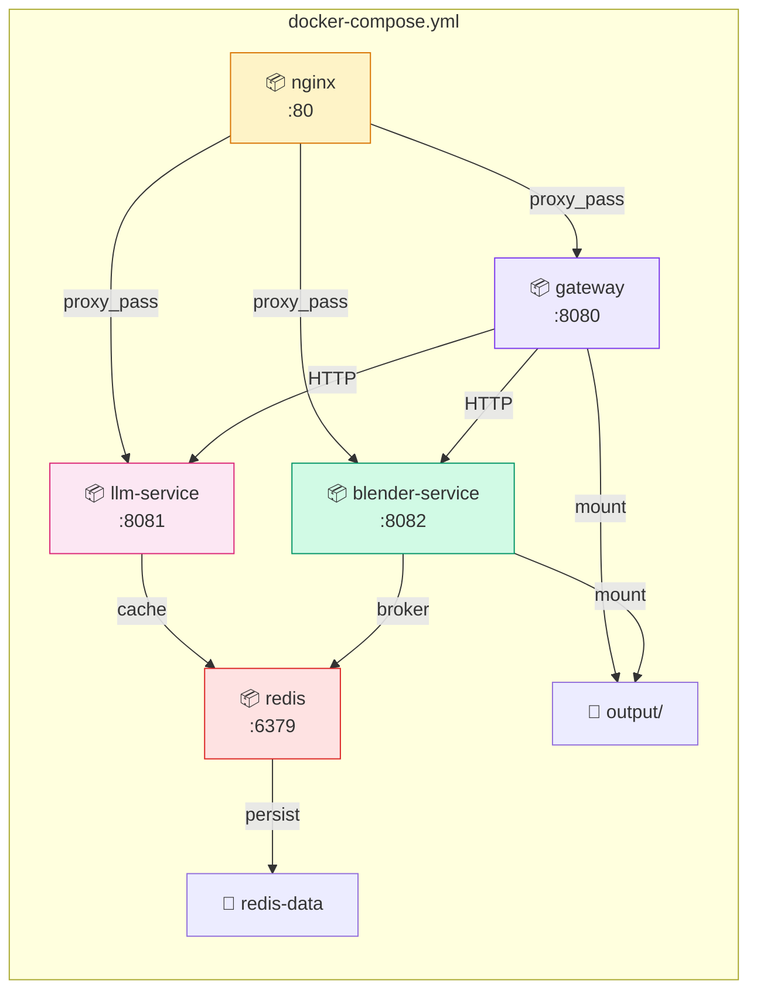
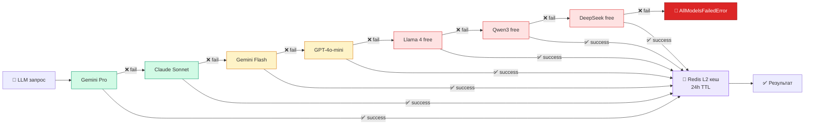
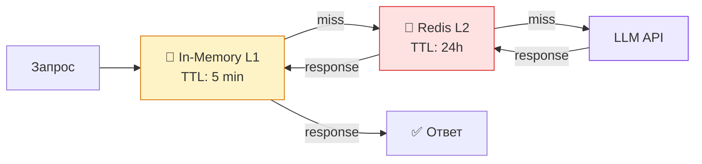
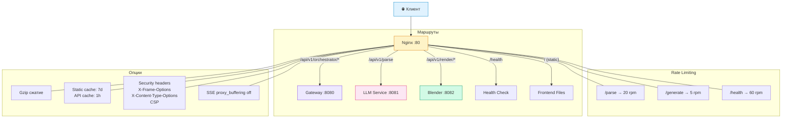
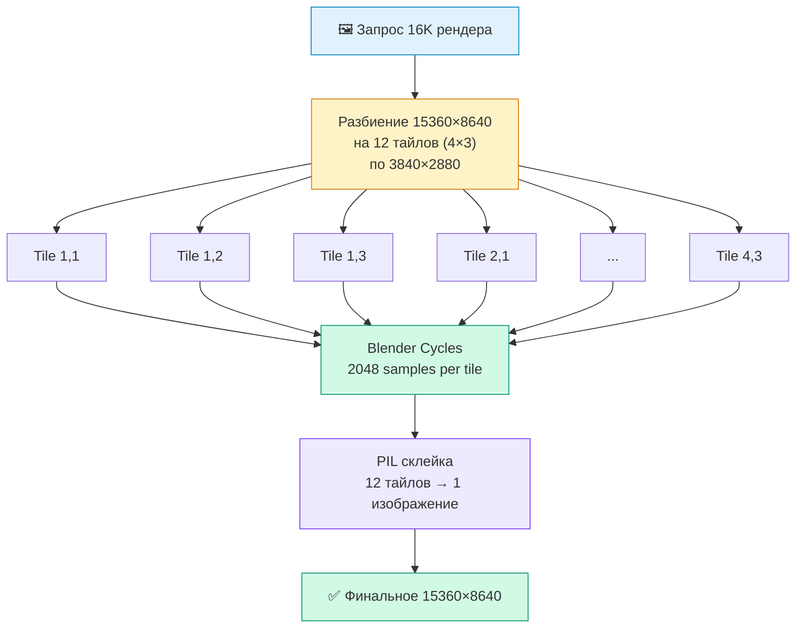
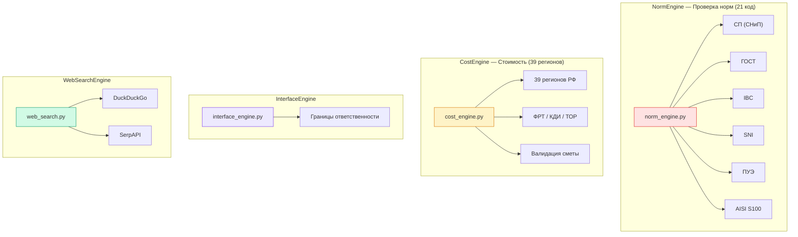
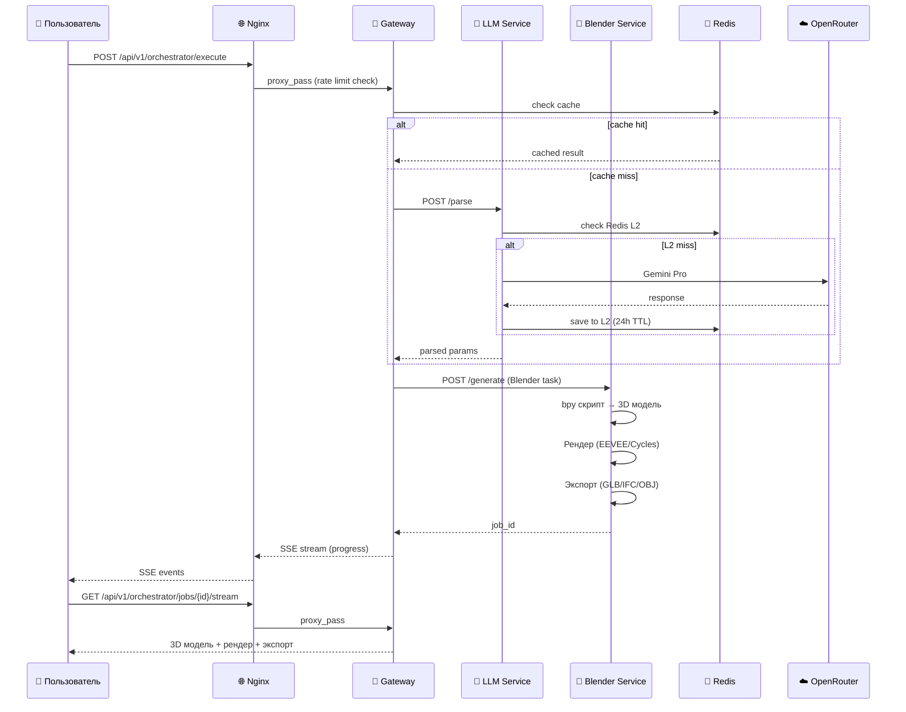

# Architect v7.0 🏗️

> **🌐 Сайт: [https://smartmoneymoscow-cell.github.io/AI_Arhitector/](https://smartmoneymoscow-cell.github.io/AI_Arhitector/)**

AI-архитектор — генерация 3D-моделей зданий и интерьеров по текстовому описанию на русском языке.

---

## Архитектура системы

### Общая схема (High-Level Architecture)



### Микросервисы

| Сервис | Образ | Порт | Описание |
|--------|-------|------|----------|
| **Nginx** | nginx:1.27-alpine | 80 | Rate limiting, gzip, cache, SSL, security headers |
| **Gateway** | ~200 MB | 8080 | API Gateway, оркестрация, frontend |
| **LLM Service** | ~200 MB | 8081 | LLM-only парсинг (каскад 7 моделей + Redis кеш) |
| **Blender Service** | ~3 GB | 8082 | 3D генерация, рендер (до 16K tiled), экспорт |
| **Redis** | redis:7-alpine | 6379 | LLM кеш (24h TTL) + Celery broker |

### Docker Compose — схема контейнеров



---

## Multi-Agent Pipeline (22 агента)

### Схема пайплайна

```mermaid
graph TB
    PROMPT["📝 Промт пользователя"] --> PARSER["🔍 ParserAgent<br/>Каскад 7 LLM + Redis кеш"]

    PARSER --> ORCH["🎯 LLM Orchestrator<br/>Выбор pipeline profile"]

    ORCH -->|"quick (5)"| QP["Parser → Geometry<br/>→ Render → Export"]
    ORCH -->|"standard (8)"| SP["+ Style · Lighting · Quality"]
    ORCH -->|"full (14)"| FP["+ Research · Concept · Masterplan<br/>· Furniture · Structural · Compliance"]
    ORCH -->|"premium (22)"| PP["Все 22 агента"]

    subgraph "Pipeline агенты (6)"
        PA1["🔍 ParserAgent"]
        PA2["📐 GeometryAgent"]
        PA3["🎨 TextureAgent"]
        PA4["🖼️ RenderAgent"]
        PA5["📦 ExportAgent"]
        PA6["✅ QualityAgent"]
    end

    subgraph "Интеллектуальные агенты (8)"
        IA1["🔬 ResearchAgent"]
        IA2["📊 MarketAgent"]
        IA3["💡 ConceptAgent"]
        IA4["🗺️ MasterplanAgent"]
        IA5["🌳 LandscapeAgent"]
        IA6["🏷️ BrandAgent"]
        IA7["💰 FinancialAgent"]
        IA8["📑 PresentationAgent"]
    end

    subgraph "Специализированные агенты (8)"
        SA1["🎭 StyleAgent"]
        SA2["💡 LightingAgent"]
        SA3["🪑 FurnitureAgent"]
        SA4["⚡ MEPAgent"]
        SA5["🏗️ StructuralAgent"]
        SA6["📋 ComplianceAgent"]
        SA7["🔌 ELAgent"]
        SA8["🔧 MEPBIMAgent"]
    end

    QP --> PA1 & PA2 & PA4 & PA5
    SP --> PA1 & PA2 & PA4 & PA5 & SA1 & SA2 & PA6
    FP --> PA1 & PA2 & PA4 & PA5 & SA1 & SA2 & PA6 & IA1 & IA3 & IA4 & SA3 & SA5 & SA6
    PP --> PA1 & PA2 & PA3 & PA4 & PA5 & PA6 & IA1 & IA2 & IA3 & IA4 & IA5 & IA6 & IA7 & IA8 & SA1 & SA2 & SA3 & SA4 & SA5 & SA6 & SA7 & SA8

    style PROMPT fill:#e0f2fe,stroke:#0284c7
    style PARSER fill:#fce7f3,stroke:#db2777
    style ORCH fill:#ede9fe,stroke:#7c3aed
    style QP fill:#d1fae5,stroke:#059669
    style SP fill:#fef3c7,stroke:#d97706
    style FP fill:#fee2e2,stroke:#dc2626
    style PP fill:#f3e8ff,stroke:#9333ea
```



### Pipeline агенты (6)

| Агент | Описание |
|-------|----------|
| **ParserAgent** | Парсинг промтов (каскад 7 LLM моделей + Redis кеш) |
| **GeometryAgent** | Генерация 3D геометрии (Blender bpy-скрипты) |
| **TextureAgent** | PBR материалы и текстуры (2048px) |
| **RenderAgent** | Рендер изображений (EEVEE Next / Cycles до 16K tiled) |
| **ExportAgent** | Экспорт в форматы (GLB, IFC, OBJ, SVG, STEP) |
| **QualityAgent** | Проверка качества рендера (разрешение, file size, mimo-omni) |

### Интеллектуальные агенты (8)

| Агент | Описание |
|-------|----------|
| **ResearchAgent** | Поиск архитектурных референсов, анализ трендов |
| **MarketAgent** | Анализ рынка недвижимости, конкурентов, ценообразование |
| **ConceptAgent** | Концептуальный дизайн, мудборды, палитры |
| **MasterplanAgent** | Генерация мастер-плана участка (зонирование, дороги, отступы) |
| **LandscapeAgent** | Ландшафтный дизайн (деревья, дорожки, бассейн, освещение) |
| **BrandAgent** | Бренд-стиль, айдентика, фирменный архитектурный язык |
| **FinancialAgent** | Финансовая оценка (стоимость, ROI, окупаемость, смета) |
| **PresentationAgent** | Генерация HTML-презентаций проекта |

### Специализированные агенты (8)

| Агент | Описание |
|-------|----------|
| **StyleAgent** | Определение и применение архитектурного стиля (12 стилей) |
| **LightingAgent** | Настройка освещения (время суток, интерьерное, HDRI) |
| **FurnitureAgent** | Эргономичное размещение мебели (каталог по типам комнат) |
| **MEPAgent** | Инженерные системы (электрика, водоснабжение, HVAC, слаботочка) |
| **StructuralAgent** | Конструктивный расчёт (фундамент, стены, перекрытия, крыша) |
| **ComplianceAgent** | Проверка соответствия нормам (СП, ГОСТ, IBC, пожарная безопасность) |
| **ELAgent** | Квартирная электрика (трассы в стяжке, однолинейная схема, автоматы, УЗО) + умный дом (KNX, Loxone, Zigbee) + распознавание зарисовок |
| **MEPBIMAgent** | MEP BIM-моделирование (Revit MEP, стадия Р, LOD 300+, 16K-ready, импорт расчётов) |

### Pipeline Profiles

| Профиль | Агенты | Описание |
|---------|--------|----------|
| `quick` | 5 | Быстрый preview (parse → geometry → render → export) |
| `standard` | 8 | Стандартный ( + style, lighting, quality) |
| `full` | 14 | Полный ( + research, concept, masterplan, furniture, structural, compliance) |
| `premium` | 22 | Все 22 агента ( + market, brand, landscape, MEP, financial, presentation, EL, MEP-BIM) |
| `interior` | 9 | Интерьер (concept, style, furniture, lighting) |
| `presentation` | 9 | С презентацией (concept, style + presentation) |

---

## LLM Каскад — схема отказоустойчивости



### Кеширование (двухуровневое)



---

## Nginx Gateway — схема маршрутизации



---

## 16K Tiled Rendering — схема



---

## Движки (Engines)



| Движок | Файл | Описание |
|--------|------|----------|
| **NormEngine** | `shared/norm_engine.py` | Проверка строительных норм (21 код: СП, ГОСТ, IBC, SNI, ПУЭ, AISI S100) |
| **CostEngine** | `shared/cost_engine.py` | Калькуляция стоимости (39 регионов, господдержка ФРТ/КДИ/ТОР, валидация) |
| **InterfaceEngine** | `shared/interface_engine.py` | Границы ответственности между исполнителями (Interface Definition) |
| **WebSearchEngine** | `shared/web_search.py` | Веб-поиск (DuckDuckGo + SerpAPI) для ResearchAgent и MarketAgent |

---

## Поток данных (Data Flow)



---

## Что нового в v7.0

### 🤖 22 агента (было 6)
- 16 новых агентов: Research, Market, Concept, Masterplan, Landscape, Brand, Financial, Presentation, Style, Lighting, Furniture, MEP, Structural, Compliance, EL, MEP-BIM
- LLM-driven оркестратор с pipeline profiles
- Параллельное выполнение независимых агентов

### 🔧 3 новых движка
- **NormEngine** — проверка по СП, ГОСТ, IBC (эвакуация, этажность, высота, лестницы, остекление)
- **CostEngine** — полная смета (стены, крыша, фундамент, перекрытия, инженерия, ландшафт)
- **WebSearchEngine** — веб-поиск для исследований и анализа рынка

### 🤖 LLM-only парсинг (regex УДАЛЁН)
- Каскад 7 моделей: Gemini Pro → Claude Sonnet → Gemini Flash → GPT-4o-mini → Llama 4 free → Qwen3 free → DeepSeek free
- Redis кеш (L2, 24h TTL) + in-memory (L1, 5min TTL)
- `AllModelsFailedError` при недоступности всех моделей

### 🌐 Nginx Gateway
- Rate limiting: `/parse` 20rpm, `/generate` 5rpm, `/health` 60rpm
- SSE proxy buffering off для streaming
- Gzip сжатие, static caching (7 дней), API response caching (1h)
- Security headers (X-Frame-Options, X-Content-Type-Options, CSP)

### 🖼️ 16K Tiled Rendering
- Разбивает 15360×8640 на 12 тайлов (4×3 по 3840×2880)
- Рендерит каждый тайл через Blender Cycles (2048 samples)
- Собирает финальное изображение через PIL

### 🔐 Auth
- API key через `X-API-Key` header
- Rate limiting (30 rpm / 200 rph per client)

---

## Быстрый старт

### Docker Compose (рекомендуется)

```bash
export OPENROUTER_API_KEY="***"
docker-compose up --build
# → http://localhost:80
```

### Локально

```bash
pip install fastapi uvicorn httpx pydantic ifcopenshell shapely networkx celery redis Pillow

cp .env.example .env
python server.py
# → http://localhost:8080
```

---

## API

### Генерация (через оркестратор)

```bash
# Полный pipeline с 16K качеством
curl -X POST http://localhost/api/v1/orchestrator/execute \
  -H "Content-Type: application/json" \
  -d '{"prompt": "двухэтажный кирпичный дом 10x12", "quality": "16k", "export_formats": ["glb", "ifc"]}'

# Premium pipeline (все 22 агента)
curl -X POST http://localhost/api/v1/orchestrator/execute \
  -H "Content-Type: application/json" \
  -d '{"prompt": "современный коттедж 12x15 с бассейном", "quality": "16k", "pipeline_profile": "premium"}'

# Быстрое превью
curl -X POST http://localhost/api/v1/preview \
  -H "Content-Type: application/json" \
  -d '{"prompt": "современная спальня 6x8"}' --output preview.png

# SSE stream прогресса
curl http://localhost/api/v1/orchestrator/jobs/{job_id}/stream
```

### Pipeline Profiles

```json
{
  "prompt": "...",
  "quality": "16k",
  "pipeline_profile": "premium",
  "export_formats": ["glb", "ifc", "svg"]
}
```

Значения `pipeline_profile`: `quick`, `standard`, `full`, `premium`, `interior`, `presentation`

### Endpoints

| Endpoint | Метод | Описание |
|----------|-------|----------|
| `/api/v1/orchestrator/execute` | POST | Полный pipeline (22 агента) |
| `/api/v1/orchestrator/jobs/{id}` | GET | Статус задачи |
| `/api/v1/orchestrator/jobs/{id}/stream` | GET | SSE прогресс |
| `/api/v1/preview` | POST | Быстрое превью |
| `/api/v1/generate` | POST | Быстрая генерация (legacy) |
| `/api/v1/parse` | POST | Парсинг промта (LLM-only) |
| `/api/v1/render/16k` | POST | 16K tiled rendering |
| `/api/v1/health` | GET | Health check |

---

## Структура проекта

```
AI_Arhitector/
├── shared/                        # Единая библиотека
│   ├── config.py                  # Настройки из env
│   ├── models.py                  # Pydantic-модели
│   ├── validation.py              # Валидация параметров
│   ├── parser.py                  # LLM-only парсинг (каскад 7 моделей)
│   ├── auth.py                    # API key + rate limiting
│   ├── tiled_render.py            # 16K tiled rendering
│   ├── blender.py                 # bpy-скрипты (PBR, лестницы)
│   ├── ifc_generator.py           # IFC через IfcOpenShell
│   ├── floorplan.py               # SVG планы через Shapely
│   ├── preview.py                 # Превью + анализ
│   ├── streaming.py               # SSE прогресс
│   ├── clarification.py           # Уточняющие вопросы
│   ├── web_search.py              # Веб-поиск (DuckDuckGo/SerpAPI)
│   ├── norm_engine.py             # Проверка строительных норм (21 код)
│   ├── cost_engine.py             # Калькуляция стоимости (39 регионов)
│   ├── interface_engine.py        # Границы ответственности (Interface Definition)
│   └── agents/                    # Multi-agent система (22 агента)
│       ├── __init__.py            # Реестр всех агентов
│       ├── base.py                # BaseAgent, Task, TaskResult
│       ├── orchestrator.py        # LLM-driven оркестратор
│       ├── parser_agent.py        # LLM-only парсинг
│       ├── geometry_agent.py      # Генерация геометрии
│       ├── texture_agent.py       # PBR материалы
│       ├── render_agent.py        # Рендер (до 16K)
│       ├── export_agent.py        # Экспорт (GLB/IFC/OBJ)
│       ├── quality_agent.py       # Проверка качества
│       ├── research_agent.py      # Поиск референсов
│       ├── market_agent.py        # Анализ рынка
│       ├── concept_agent.py       # Концептуальный дизайн
│       ├── masterplan_agent.py    # Мастер-план участка
│       ├── landscape_agent.py     # Ландшафтный дизайн
│       ├── brand_agent.py         # Бренд-стиль
│       ├── financial_agent.py     # Финансовая оценка
│       ├── presentation_agent.py  # Генерация презентаций
│       ├── style_agent.py         # Определение стиля
│       ├── lighting_agent.py      # Освещение
│       ├── furniture_agent.py     # Размещение мебели
│       ├── mep_agent.py           # Инженерные системы
│       ├── structural_agent.py    # Конструктивный расчёт
│       ├── compliance_agent.py    # Проверка норм
│       ├── el_agent.py            # Квартирная электрика + умный дом
│       └── mep_bim_agent.py       # MEP BIM-моделирование (Revit)
├── gateway/                       # API Gateway (:8080)
├── llm-service/                   # LLM прокси (:8081)
├── blender-service/               # Blender CLI (:8082)
├── nginx.conf                     # Nginx конфиг
├── gateway.Dockerfile             # Gateway образ (~200MB)
├── llm.Dockerfile                 # LLM Service образ (~200MB)
├── blender.Dockerfile             # Blender Service образ (~3GB)
├── docker-compose.yml             # Production compose
├── index.html                     # Frontend (3D viewer)
├── AUDIT.md                       # Ответы на 12 вопросов аудита
├── ROADMAP.md                     # 6-фазный план улучшений
├── tests/                         # Тесты (169 total)
│   ├── test_generation.py         # Unit-тесты парсера
│   ├── test_server.py             # Unit-тесты сервера
│   ├── test_orchestrator.py       # Unit-тесты оркестратора
│   ├── test_e2e.py                # E2E тесты (моки)
│   └── test_e2e_automated.py      # Автоматизированные E2E
└── server.py                      # Монолит (локальная разработка)
```

---

## Технологический стек

| Компонент | Технология | Статус |
|-----------|-----------|--------|
| API Gateway | FastAPI + Nginx | ✅ |
| LLM | OpenRouter (7-model cascade) | ✅ |
| Cache | Redis (24h) + in-memory (5min) | ✅ |
| 3D Rendering | Blender CLI (EEVEE Next / Cycles) | ✅ |
| BIM/IFC | IfcOpenShell | ✅ |
| Floor Plans | Shapely + SVG | ✅ |
| 3D Viewer | Three.js | ✅ |
| Async Queue | Celery + Redis | ✅ |
| Quality Check | QualityAgent + mimo-omni | ✅ |
| Auth | API key + rate limiting | ✅ |
| Multi-Agent | 22 агента + LLM Orchestrator | ✅ |
| Norm Check | NormEngine (21 код: СП, ГОСТ, IBC, SNI, ПУЭ, AISI) | ✅ |
| Cost Calc | CostEngine (39 регионов, господдержка, валидация) | ✅ |
| Interface Def | InterfaceEngine (границы ответственности) | ✅ |
| Apartment Electr. | ELAgent (трассы, автоматы, УЗО, умный дом) | ✅ |
| MEP BIM | MEPBIMAgent (Revit MEP, стадия Р, LOD 300+) | ✅ |
| Web Search | WebSearchEngine (DDG/SerpAPI) | ✅ |
| Frontend | Three.js + Vanilla JS | ✅ |
| Deployment | Docker Compose / Render.com | ✅ |

---

## Переменные окружения

| Переменная | Обязательна | Описание |
|-----------|-------------|----------|
| `OPENROUTER_API_KEY` | Да | Ключ от openrouter.ai |
| `LLM_MODEL` | Нет | Модель LLM (default: google/gemini-2.5-flash) |
| `REDIS_URL` | Нет | Redis (default: redis://localhost:6379/0) |
| `BLENDER_PATH` | Нет | Путь к Blender (default: blender) |
| `OUTPUT_DIR` | Нет | Директория выходных файлов (default: /app/output) |
| `ARCH_API_KEYS` | Нет | API ключи (через запятую) |
| `CORS_ORIGINS` | Нет | Разрешённые origins (через запятую, default: *) |
| `SERPAPI_KEY` | Нет | Ключ SerpAPI для веб-поиска (опционально) |

---

## Деплой

### Render.com

Проект настроен для деплоя на Render (Oregon region):

- **architect** — Gateway (starter plan)
- **ai-arch-llmproxy** — LLM Service (starter plan)
- **ai-arch-blender3d** — Blender Service (standard plan)
- **architect-redis** — Redis (starter plan)

### GitHub Pages (Frontend)

🌐 **[https://smartmoneymoscow-cell.github.io/AI_Arhitector/](https://smartmoneymoscow-cell.github.io/AI_Arhitector/)**

---

## Лицензия

MIT
