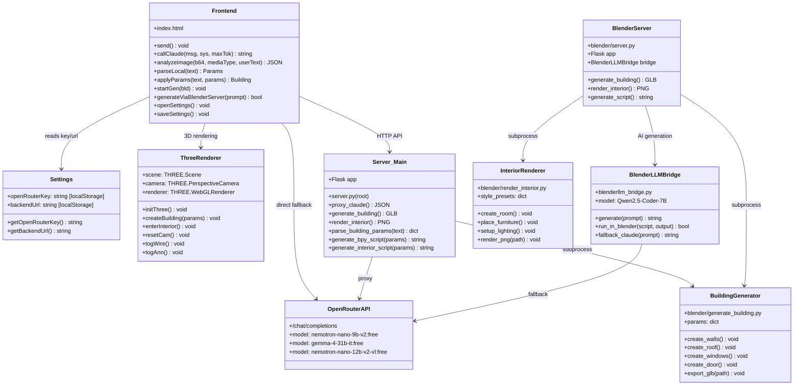
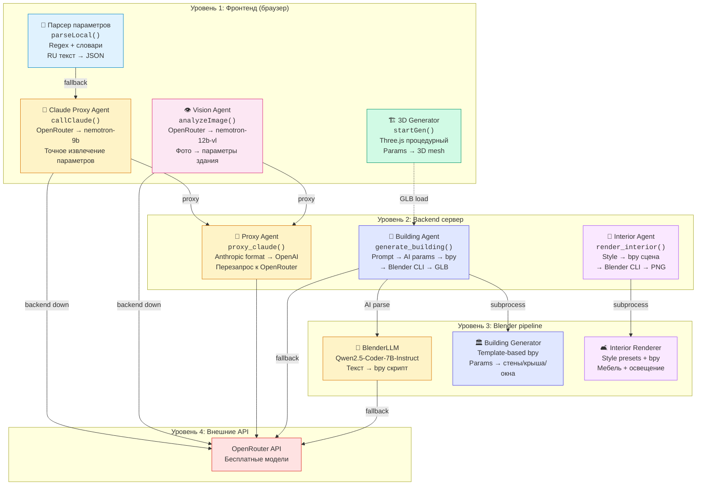

# Architect v10.2 🏗️

AI-архитектор — генерация 3D-моделей зданий и интерьеров по текстовому описанию на русском языке.

## Быстрый старт

1. Откройте сайт
2. Нажмите **⚙️ Настройки** → введите OpenRouter API ключ (`sk-or-v1-...`) от [openrouter.ai/keys](https://openrouter.ai/keys)
3. Опишите здание: *двухэтажный кирпичный дом 10×12*, *офис 5 этажей стекло*, *коттедж с террасой*

> Бесплатные модели работают без баланса, но ключ обязателен.

## Деплой

### GitHub Pages (только фронтенд)
Сервис работает в браузере. Three.js рендерит 3D локально, OpenRouter API вызывается напрямую. Blender-рендеринг недоступен.

### Локальный сервер (полный функционал)
```bash
pip install flask flask-cors httpx
export OPENROUTER_API_KEY="sk-or-v1-..."
python server.py
# → http://localhost:8080
```

Для Blender-рендеринга GLB-моделей:
```bash
export BLENDER_PATH="/path/to/blender"
```

---

## Архитектура

```
┌─────────────────────────────────────────────────────────────────┐
│                        FRONTEND (index.html)                     │
│                                                                  │
│  ┌──────────┐  ┌──────────┐  ┌──────────┐  ┌──────────────────┐ │
│  │ Chat UI  │  │ 3D View  │  │ 2D Plan  │  │ Settings (⚙️)    │ │
│  │ (sidebar)│  │ (Three.js│  │ (Canvas) │  │ API Key + Backend│ │
│  │          │  │  + WebGL) │  │          │  │ URL (localStorage)│ │
│  └────┬─────┘  └─────┬────┘  └──────────┘  └──────────────────┘ │
│       │              │                                            │
│  ┌────┴──────────────┴────────────────────────────────────────┐  │
│  │                    JS Engine Layer                          │  │
│  │  • parseLocal()    — regex-парсинг русского текста         │  │
│  │  • callClaude()    — прокси → OpenRouter fallback          │  │
│  │  • analyzeImage()  — Claude Vision / OpenRouter VL          │  │
│  │  • startGen()      — Three.js процедурная генерация        │  │
│  │  • generateViaBlenderServer() — GLB с сервера              │  │
│  └───────────┬─────────────────────┬──────────────────────────┘  │
│              │                     │                              │
└──────────────┼─────────────────────┼──────────────────────────────┘
               │                     │
       ┌───────▼───────┐    ┌───────▼───────────┐
       │  OpenRouter    │    │  Backend Server    │
       │  API (free)    │    │  (server.py)       │
       │                │    │                     │
       │ • nemotron-nano│    │ ┌─────────────────┐│
       │   -9b-v2:free  │    │ │ /api/v1/health  ││
       │ • gemma-4-31b  │    │ │ /proxy/claude   ││
       │   -it:free     │    │ │ /generate/build ││
       └────────────────┘    │ │ /render/interior││
                              │ └────────┬────────┘│
                              │          │         │
                              │ ┌────────▼────────┐│
                              │ │ OpenRouter API  ││
                              │ │ (server-side    ││
                              │ │  key in env)    ││
                              │ └─────────────────┘│
                              │ ┌─────────────────┐│
                              │ │ Blender CLI     ││
                              │ │ (subprocess)    ││
                              │ │ → GLB / PNG     ││
                              │ └─────────────────┘│
                              └─────────────────────┘

       ┌─────────────────────────────────┐
       │  Blender/ (scripts)              │
       │                                  │
       │  blenderllm_bridge.py            │
       │   └─ BlenderLLM (Qwen2.5-7B)    │
       │   └─ Claude fallback             │
       │                                  │
       │  generate_building.py            │
       │   └─ Параметры → bpy → GLB      │
       │                                  │
       │  render_interior.py              │
       │   └─ Стиль → сцена → PNG        │
       │                                  │
       │  server.py (blender/)            │
       │   └─ Flask API для Blender GUI   │
       └─────────────────────────────────┘
```

---

## UML-диаграмма классов



---

## Схема AI-агентов



### Описание агентов

| # | Агент | Уровень | Модель | Роль |
|---|-------|---------|--------|------|
| 1 | **Парсер параметров** | Браузер | — (regex) | Первичный парсинг RU текста → структурированные параметры |
| 2 | **Claude Proxy Agent** | Браузер → Backend | nemotron-nano-9b-v2:free | Точное извлечение параметров через LLM |
| 3 | **Vision Agent** | Браузер → Backend | nemotron-nano-12b-v2-vl:free | Анализ фото/чертежей → параметры здания |
| 4 | **3D Generator** | Браузер | — (Three.js) | Процедурная генерация 3D из параметров |
| 5 | **Proxy Agent** | Backend | — (прокси) | Конвертация форматов, маршрутизация к OpenRouter |
| 6 | **Building Agent** | Backend | nemotron-9b + Blender | Полный цикл: текст → AI → bpy → GLB |
| 7 | **Interior Agent** | Backend | Blender | Генерация интерьеров: стиль → bpy → PNG |
| 8 | **BlenderLLM** | Blender | Qwen2.5-Coder-7B-Instruct | Генерация bpy скриптов из текста (AI) |

**Итого: 8 агентов** (4 в браузере, 3 на сервере, 1 в Blender pipeline)

---

## Функции

- 🏠 **3D-генерация** зданий по тексту (Three.js + Blender GLB)
- 📐 **2D-планы** этажей
- 🪟 **Интерьер / экстерьер** с пресетами стилей
- 📷 **Анализ фото** (загрузка изображений → Vision AI)
- 🎤 **Голосовой ввод** (Web Speech API, RU)
- 🔄 Поворот, зум, навигация по этажам
- ⚙️ Настройки API ключа и backend URL

## Стек

| Компонент | Технология |
|-----------|-----------|
| Frontend | HTML/CSS/JS, Three.js r160 |
| Backend | Flask, httpx |
| AI (free) | OpenRouter: nemotron-nano-9b-v2, gemma-4-31b-it |
| AI (vision) | OpenRouter: nemotron-nano-12b-v2-vl |
| AI (Blender) | BlenderLLM (Qwen2.5-Coder-7B-Instruct) |
| 3D рендер | Three.js (браузер) + Blender CLI (сервер) |
| Хранение | localStorage (ключ, URL) |

## Структура проекта

```
AI_Arhitector/
├── index.html              # Фронтенд (SPA, ~2600 строк)
├── server.py               # Flask backend (proxy + Blender)
├── README.md
├── .nojekyll
├── blender/
│   ├── blenderllm_bridge.py   # BlenderLLM ↔ bpy bridge
│   ├── generate_building.py   # Параметры → bpy → GLB
│   ├── render_interior.py     # Стиль → bpy → PNG
│   └── server.py              # Blender-специфичный Flask API
├── colab/
│   └── ArchAI_Blender.ipynb   # Google Colab notebook
├── frontend/
│   └── index.html             # Копия фронтенда
└── output/                    # Сгенерированные модели
```

## Лицензия

Проект открытый. Автор: [smartmoneymoscow-cell](https://github.com/smartmoneymoscow-cell)
