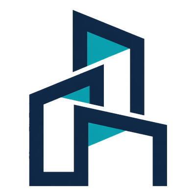

<div align="center">



# Aedifex

**Open-source 3D architectural editor with AI design assistant**

Design buildings with natural language — AI creates walls, places doors & windows, arranges furniture, and previews changes in real-time. Powered by WebGPU.

[](LICENSE)

[**English**](./README.md) | [**中文**](./README.zh-CN.md)

https://github.com/user-attachments/assets/6c819726-65f4-45c6-903e-fa5c364a6340

</div>

## Features

### Structure & Layout

- **Wall System** — Draw walls with automatic mitering, adjustable thickness and height. Walls snap to a 0.5m grid for precision.
- **Doors & Windows** — Place doors and windows on walls with configurable dimensions, swing direction, and hinge side.
- **Zones** — Rooms are auto-detected from wall boundaries. Zones display area, shape analysis, and spatial metadata.
- **Multi-Level** — Stack, explode, or solo levels. Each level maintains independent floor plans.
- **Slabs, Ceilings & Roofs** — Draw floor plates, ceilings, and roof segments with polygon-based geometry.

### Furniture & Items

- **Catalog** — Built-in furniture catalog with sofas, tables, chairs, beds, bookshelves, lamps, trees, and more.
- **Smart Placement** — Collision detection, wall-snap alignment, and zone-boundary clamping ensure items stay within rooms.
- **Interactive Items** — Toggle lights, adjust lamp brightness, and control interactive elements.

### Materials

- **10 Presets** — White, brick, concrete, wood, glass, metal, plaster, tile, marble, and custom.
- **Custom Properties** — Color, roughness, metalness, opacity, transparency per node.
- **All Node Types** — Apply materials to walls, slabs, doors, windows, ceilings, and roofs.

### Viewing & Navigation

- **Street View** — First-person walkthrough mode. WASD to move, mouse to look, Q/E to float. Explore your designs from inside.
- **Dark / Light Theme** — Toggle between dark and light viewport themes.
- **Compass HUD** — Always-visible cardinal direction indicator.
- **Camera Controls** — Orbit, pan, zoom with mouse or trackpad. Optimized for Mac touchpad (two-finger pan + pinch zoom + right-click rotate).

### Export

- **GLB** — Standard glTF binary format for web and game engines.
- **STL** — For 3D printing.
- **OBJ** — Universal exchange format.

### AI Design Assistant

- **Natural Language** — Describe what you want: *"Create a 5m x 4m room and furnish it as a bedroom."*
- **16 Tools** — Add/remove/move furniture, create walls, place doors & windows, update wall height/door width/window size, batch operations, propose multiple placement options, and ask clarifying questions.
- **Ghost Preview** — See AI suggestions as transparent previews before confirming.
- **Agentic Loop** — AI iterates on results, auto-corrects positions for collision and zone boundaries, and asks clarifying questions when the request is ambiguous.
- **Catalog Matching** — Fuzzy name matching with shape-variant warnings (e.g., warns if you ask for a round table but only rectangular is available).

---

## Quick Start

### Requirements

- **Node.js** 20+
- **pnpm** 9+ (`npm install -g pnpm`)
- A **WebGPU-capable browser**: Chrome 113+, Edge 113+, or Firefox Nightly

### Setup

```bash
# Clone
git clone https://github.com/TangSY/aedifex.git
cd aedifex

# Install dependencies
pnpm install

# Start dev server (all packages + editor)
pnpm dev

# Open http://localhost:3002
```

### AI Assistant Configuration (Optional)

The AI design assistant requires an OpenAI-compatible API key. Without it, the editor works normally but the AI panel will be disabled.

1. Copy the example config:

```bash
cp .env.example apps/editor/.env.local
```

2. Edit `apps/editor/.env.local` and fill in your API key:

```env
# Required — your OpenAI API key (or any OpenAI-compatible provider)
AI_API_KEY=sk-your-api-key-here

# Optional — change the base URL for compatible providers (e.g., Azure, local LLM)
AI_BASE_URL=https://api.openai.com/v1

# Optional — model selection (defaults shown)
AI_CHAT_MODEL=gpt-4o
AI_SUMMARIZE_MODEL=gpt-4o-mini
```

> **Note:** The AI assistant calls OpenAI-compatible APIs directly from the server. Your API key is never exposed to the browser. Any provider that implements the OpenAI chat completions API is supported (OpenAI, Azure OpenAI, Anthropic via proxy, local Ollama, etc.).

---

## Controls

### Mouse

| Action | Input |
|--------|-------|
| Select | Left click |
| Pan | Middle click drag, or Space + left click |
| Rotate | Right click drag |
| Zoom | Scroll wheel |

### Trackpad (Mac)

| Action | Gesture |
|--------|---------|
| Pan | Two-finger drag |
| Zoom | Pinch |
| Rotate | Right-click drag (two-finger tap + drag) |

### Street View Mode

| Action | Input |
|--------|-------|
| Move | WASD |
| Look | Mouse |
| Float up/down | Q / E |
| Exit | Escape |

---

## Architecture

Turborepo monorepo with five published packages plus the editor app:

```
aedifex/
├── apps/editor/         # Next.js 16 application (entry point)
├── packages/core/       # Schema, state (Zustand), systems, spatial queries
├── packages/viewer/     # 3D rendering (React Three Fiber + WebGPU)
├── packages/editor/     # Editor UI: tools, panels, selection, AI assistant
├── packages/mcp/        # MCP server: 35 tools for natural-language scene control
└── packages/ui/         # Shared shadcn/ui primitives
```

| Package | Responsibility |
|---------|---------------|
| **core** | Node schemas (Zod), scene store with undo/redo (Zundo), geometry systems, spatial grid, event bus |
| **viewer** | Renderers, camera, lighting, post-processing, level/scan/guide systems |
| **editor** | Tools, panels, selection manager, AI assistant, custom camera controls |
| **mcp** | Model Context Protocol server exposing scene operations to Claude Desktop / Cursor |
| **ui** | Shared shadcn/ui primitives consumed by the editor |

### Scene Data Model

Nodes are stored in a **flat dictionary** with `parentId` references:

```
Site → Building → Level → Wall → Door / Window
                        → Zone
                        → Slab / Ceiling / Roof
                        → Item (furniture)
```

### Key Files

| Path | Description |
|------|-------------|
| `packages/core/src/schema/` | Node type definitions (Zod schemas) |
| `packages/core/src/schema/material.ts` | Material system (10 presets + custom properties) |
| `packages/core/src/store/use-scene.ts` | Scene state store |
| `packages/core/src/systems/` | Geometry generation systems |
| `packages/viewer/src/components/renderers/` | Node renderers |
| `packages/viewer/src/components/viewer/` | Main Viewer component |
| `packages/editor/src/components/tools/` | Editor tools (wall, zone, item, slab) |
| `packages/editor/src/components/ai/` | AI assistant (prompt, agent loop, validators) |
| `packages/editor/src/components/editor/first-person-controls.tsx` | Street view mode |
| `packages/editor/src/components/editor/export-manager.tsx` | Scene export (GLB, STL, OBJ) |

### Tech Stack

| Layer | Technology |
|-------|-----------|
| Rendering | Three.js (WebGPU), React Three Fiber, Drei |
| Framework | React 19, Next.js 16 |
| State | Zustand + Zundo (undo/redo) |
| Schema | Zod |
| Geometry | three-bvh-csg (Boolean operations) |
| Tooling | TypeScript 5, Turborepo, pnpm |

---

## Contributing

See [CONTRIBUTING.md](CONTRIBUTING.md) for development guidelines.

```bash
# Build all packages
turbo build

# Build specific package
turbo build --filter=@aedifex/core
```

---

## Acknowledgments

Aedifex is built upon [Pascal Editor](https://github.com/pascalorg/editor) by Pascal Group Inc., licensed under MIT. We extend our gratitude to the original authors for their excellent work on the 3D architectural editor core.

---

## License

[MIT](LICENSE)

---

## Links

- [LINUX DO](https://linux.do/)
